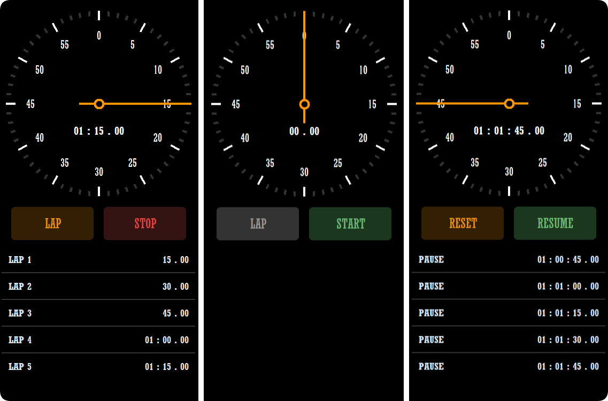

# STOPWATCH GUI APPLICATION

    <em>
        Stopwatch is a simple yet effective application designed to help users keep precise track of time in their daily routines or specific activities. The app features a clear and intuitive interface that allows users to start, pause, and reset the timer effortlessly. Additionally, it offers the ability to record and save multiple laps, making it easy to monitor different intervals within a single session. Each lap is stored with a timestamp, providing detailed insights into individual segments of time. Whether you’re timing a workout, cooking a recipe, or managing a work task, Stopwatch ensures you have a reliable tool to measure and manage time efficiently.
    </em>

